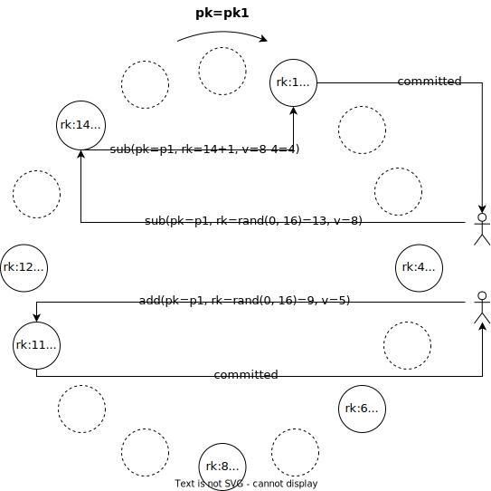

# Multi-Record Values

This repo provides several benchmarks and techniques to test and implement Multi-Record Values (MRVs), including at application-level (microbenchmark), at middleware-level (TPC-C and STAMP Vacation), and at engine-level (DBx1000).
The complete design can be found in the corresponding paper, *MRVs: Enforcing Numeric Invariants in Parallel Updates to Hotspots with Randomized Splitting*, **SIGMOD 2023**. You can check out the full paper [here](https://nuno-faria.github.io/publications/mrv).

- [Multi-Record Values](#multi-record-values)
  - [Overview](#overview)
      - [Structure](#structure)
      - [Supported Operations](#supported-operations)
      - [Example](#example)
  - [Evaluation](#evaluation)
  - [Benchmarks](#benchmarks)
    - [Microbenchmark](#microbenchmark)
      - [Build and run](#build-and-run)
      - [Works with](#works-with)
    - [TPC-C](#tpc-c)
      - [Build and run](#build-and-run-1)
      - [Works with](#works-with-1)
    - [STAMP Vacation](#stamp-vacation)
      - [Build and run](#build-and-run-2)
      - [Works with](#works-with-2)
    - [DBx1000](#dbx1000)
      - [Build and run](#build-and-run-3)
  - [Databases](#databases)
    - [PostgreSQL](#postgresql)
    - [MySQL Group Replication](#mysql-group-replication)
    - [MongoDB](#mongodb)
  - [Plot](#plot)
  - [Generic MRVs](#generic-mrvs)
  - [Reproducibility](#reproducibility)
  - [Cite](#cite)

## Overview

Multi-Record Values aim to reduce transactional conflicts or locking contention on updates to numeric values. This is achieved by partitioning the values over multiple physical records, allowing concurrent update transactions to execute simultaneously. Since both add and subtract are commutative, the operations don't need to be sequentially executed to ensure serializability. Additionally, it ensures global invariants (e.g., `total_value $\geq 0`), which makes them ideal to model accounts' balance or items' stocks. MRVs are aided by two background workers that 1) add and remove records based on the current abort rate in that MRV (*adjust*) and 2) balance the amount between records to reduce the need for *sub* operations to iterate over multiple ones (*balance*).


#### Structure

Multiple records, each containing:
- ***pk*** - the original value's primary key;
- ***rk*** - an integer that identifies a record in the structure (between 0 and *N*, where *N* is the maximum size of the MRV);
- ***v*** - the partial value.

#### Supported Operations

- ***lookup*** - searches a record: given a random *rk'*, returns the record with the minimum *rk* such that *rk >= rk'*; if none exists, returns the record with the lowest *rk*;
- ***add*** - adds a positive value to the MRV: performs a *lookup* and adds the desired amount to the retrieved record;
- ***sub*** - subtracts a positive value from the MRV: performs a *lookup* and subtracts *value_to_subtract* from *v* if *v >= value_to_subtract*, else subtracts *value_to_subtract - v* from *v*. If there is still an amount left to subtract, does a *lookup* of *rk+1* and carries the remainder to that record (with a tree-structured index, this is a simple iteration over the index). It keeps iterating until it subtracted everything it needed to subtract or reaches back to the record it started on. This last case means the MRV did not have enough amount to complete the operation, meaning the operation will have to rollback;
- ***read*** - computes the MRV value: performs a sum over the entire set;
- **gt/gte** - efficiently computes whether the MRV is greater than/greater or equal to some amount, by iterating the set and stopping as soon as the condition is met.


#### Example


In this example, we have two transactions executing concurrently: one wants to subtract 8 units from *pk1* while the other wants to add 5 units to *pk1*. As both update different physical records, they do not conflict, even though they are technically updating the same value *pk1*.

Note that the sub operation accesses two records, as the first one did not have enough value to meet the entire operation. Also note that the dashed nodes are not real records but rather representations of "empty" positions in the circular structure, which can be later assigned a physical record by the adjust worker depending on the load.


## Evaluation
[Check the `results` folder.](/results)

## Benchmarks
Tested on Ubuntu 18.04 LTS.

### Microbenchmark

A microbenchmark that simply models the stock of several products. For the read test, it obtains the stock of a random product. For the write test, it issues either add or subtract operations to a random product (read and write tests can run separately or together with the `hybrid` mode). 
- **Write** - Simple *add* and *remove* transactions over the stock of several products;
- **Read** - Transactions that retrieve the stock of a random product.
- **Hybrid** - Write or read transactions randomly chosen based on the `hybridReadRatio`.

#### Build and run

- Start the database(s);
- Install Java and Maven:
    - `sudo chmod +x deploy/install_java.sh`;
    - `./deploy/install_java.sh`.
- `cd microbench`;
- Edit configuration file at `src/main/resources/config.yaml` if necessary (dbms, connection, threads, ...);
- `mvn clean install`;
- `mvn exec:java -Dexec.mainClass="Main"`.

#### Works with
- PostgreSQL
- MySQL
- MongoDB

### TPC-C
- http://www.tpc.org/tpcc/detail.asp
- Implementation adapted from https://github.com/Percona-Lab/sysbench-tpcc.

#### Build and run
- Start the database;
- Install Lua and Sysbench:
    - `sudo chmod +x deploy/install_sysbench.sh`;
    - `./deploy/install_sysbench.sh`.
- Install Java and Maven (for the workers):
    - `sudo chmod +x deploy/install_java.sh`;
    - `./deploy/install_java.sh`.
- Install Python 3, psycopg2 and pyaml (to convert the schema):
    - `sudo chmod +x deploy/install_python.sh`;
    - `./deploy/install_python.sh`.
- `cd tpcc`;
- Update `model_tpcc.yml` and `workers_config.yml` if needed (columns to model, ...);
- Update `run.sh` if needed (connections, clients, ...);
- `sudo chmod +x *.sh *.lua`;
- `./run.sh`.

#### Works with
- PostgreSQL


### STAMP Vacation
- C. Cao Minh, J. Chung, C. Kozyrakis, and K. Olukotun. STAMP: Stanford Transactional Applications for Multi-processing. In IISWC '08: Proceedings of The IEEE International Symposium on Workload Characterization, September 2008.

The Vacation benchmark, included in the STAMP suite, simulates a travel reservation system. This benchmark, originally designed for software transactional memory (STM) systems, has a high number of add and subtract operations on numeric values. It comprises five tables: *customer*, *reservation\_info*, *car\_reservation*, *flight\_reservation*, and *room\_reservation*. Each table is populated with *r* rows.
It offers four different tasks: 
- *Make reservation* (probability=U%) -- the client checks the price of *n* items (cars, flights, rooms) and reserves a few; 
- *Delete customer* (p=(100-U)/2%) -- the total cost of a customer is computed and associated reservations are released; the customer information is deleted; 
- *Add items* (p=(100-U)/4%) -- increases the stock of *n* items; 
- *Delete items* (p=(100-U)/4%) -- decreases the stock of *n* items.

#### Build and run

- Start the database;
- Install Java and Maven (for the benchmark and the workers):
    - `sudo chmod +x deploy/install_java.sh`;
    - `./deploy/install_java.sh`.
- Install Python 3, psycopg2 and pyaml (to convert the schema):
    - `sudo chmod +x deploy/install_python.sh`;
    - `./deploy/install_python.sh`.
- `cd stamp_vacation`;
- Update `model_stamp_vacation.yml` and `workers_config.yml` if needed (columns to model, ...);
- Update `run.sh` if needed (connection, clients, ...);
- `sudo chmod +x run.sh`;
- `./run.sh`.

#### Works with
- PostgreSQL


### DBx1000
- Xiangyao Yu, George Bezerra, Andrew Pavlo, Srinivas Devadas, Michael Stonebraker, [Staring into the Abyss: An Evaluation of Concurrency Control with One Thousand Cores](http://www.vldb.org/pvldb/vol8/p209-yu.pdf), VLDB 2014

#### Build and run
- Install make and g++: `sudo apt install -y make g++`.
- `cd DBx1000`;
- Update `run.sh` if needed (warehouses, clients, ...);
- `sudo chmod +x *.sh`
- `./run.sh`


## Databases
Tested on Ubuntu 18.04 LTS.

### PostgreSQL
- `sudo chmod +x deploy/postgres/install_postgres.sh`;
- `./deploy/postgres/install_postgres.sh`.

Default connection:
- 127.0.0.1:5432;

Default credentials:
- username: postgres
- password: postgres

### MySQL Group Replication
- Install Docker in all machines used:
    - `sudo chmod +x deploy/install_docker.sh`;
    - `./deploy/install_docker.sh`.
- `cd deploy/mysqlgr`;
- `sudo chmod +x *.sh`;
- Multi-instance cluster:
    - Start MySQL Group Replication in all instances, providing for each the server id (unique integer), its IP used for communicating with the other instances, and the other instances' IPs. E.g.:
        - Instance 1: `./start_mysqlgr.sh 1 10.0.0.1 10.0.0.2 10.0.0.3`;
        - Instance 2: `./start_mysqlgr.sh 2 10.0.0.2 10.0.0.1 10.0.0.3`;
        - Instance 3: `./start_mysqlgr.sh 3 10.0.0.3 10.0.0.1 10.0.0.2`;
    - Wait at least one minute;
    - Initiate group replication at one instance:
        ```
        sudo docker exec mysqlgr mysql -uroot -proot \
            -e "SET @@GLOBAL.group_replication_bootstrap_group=1;" \
            -e "create user 'repl'@'%';" \
            -e "GRANT REPLICATION SLAVE ON *.* TO repl@'%';" \
            -e "flush privileges;" \
            -e "change master to master_user='root' for channel 'group_replication_recovery';" \
            -e "START GROUP_REPLICATION;" \
            -e "SET @@GLOBAL.group_replication_bootstrap_group=0;" \
            -e "SELECT * FROM performance_schema.replication_group_members;"
        ```
    - Initiate group replication at the remaining instances:
        ```
        sudo docker exec mysqlgr mysql -uroot -proot \
            -e "change master to master_user='repl' for channel 'group_replication_recovery';" \
            -e "START GROUP_REPLICATION;"
        ```
    - Check the cluster status:
        ```
        sudo docker exec mysqlgr mysql -uroot -proot \
            -e "SELECT * FROM performance_schema.replication_group_members;"
        ```
    - Create the database and the user (at one instance):
        ```
        sudo docker exec mysqlgr mysql -uroot -proot \
            -e "CREATE DATABASE testdb;" \
            -e "CREATE USER 'root'@'%' IDENTIFIED BY 'root';" \
            -e "GRANT ALL PRIVILEGES ON *.* TO 'root'@'%' WITH GRANT OPTION;"
        ```
    - To stop and delete the container(s):
        - `sudo docker rm --force mysqlgr`
    - Default connections: 
        - \<instance-ip\>:3306;
- Single-instance cluster:
    - Update the `docker-compose.yml` file if necessary (cpu, memory, ...);
    - Deploy cluster: `./deploy_cluster.sh`;
    - Remove cluster: `./remove_cluster.sh`.

    - Default connections:
        - 127.0.0.1:3307;
        - 127.0.0.1:3308;
        - 127.0.0.1:3309.


Default credentials:
- username: root
- password: root

### MongoDB

- Multi-instance cluster
    - Install MongoDB in all instances:
        - `cd deploy/mongodb`;
        - `sudo chmod +x *.sh`;
        - `./install_mongodb.sh`;
    - Increase the `ulimit` size:
        - `ulimit -n 10000`.
    - Prepare the replica set in all instances (replace <network_ip> with the instance's IP that will be used to communicate with the other instances; guarantee that the port 27017 is accessible to the other instances):
        - `mongod --replSet "replica_set" --bind_ip localhost,<network_ip>`;
    - Start the replica set at one instance (replace with the correct hostnames). E.g.:
        - `mongo --eval "rs.initiate({_id: 'replica_set', members: [{ _id: 0, host: \"10.0.0.1:27017\"}, { _id: 1, host: \"10.0.0.2:27017\" },   { _id : 2, host : \"10.0.0.3:27017\" } ] } )"`
    - Default connections:
        - \<server-ip\>:27017
- Single-instance cluster
    - Install Docker:
        - `sudo chmod +x deploy/install_docker.sh`;
        - `./install_docker.sh`.
    - `cd deploy/mongodb`;
    - `sudo chmod +x *.sh`;
    Update the docker-compose.yml file if necessary (cpu, memory, ...);
    - Deploy cluster `./deploy_cluster.sh`;
    - Add hostnames to work with the microbenchmark:
        - `sudo bash -c "echo '127.0.0.1 mongo1' >> /etc/hosts"`;
        - `sudo bash -c "echo '127.0.0.1 mongo2' >> /etc/hosts"`;
        - `sudo bash -c "echo '127.0.0.1 mongo3' >> /etc/hosts"`;
    - Remove cluster `./remove_cluster.sh`.

    - Default connections:
        - 127.0.0.1:27011;
        - 127.0.0.1:27012;
        - 127.0.0.1:27013.

Default credentials:
- username: *null*
- password: *null*


## Plot

- Run the benchmark;
- Install Python 3:
    - `sudo chmod +x deploy/install_python.sh`;
    - `./deploy/install_python.sh`.
- Generate csv:
    - tpcc: `cd tpcc; python3 output_to_csv.py results/`;
    - stamp_vacation: `cd stamp_vacation; python3 output_to_csv results/`;
    - microbenchmark: no additional processing needed;
    - DBx1000: `cd DBx1000; python3 output_to_csv.py results/`.
- `cd plot`;
- Install pip: `sudo apt install -y python3-pip`;
- Install dependencies: `pip3 install -r requirements.txt`;
- Plot barcharts: `python3 plot_bars.py <csv-results>`;
- Plot heatmaps (useful for results with multiple threads and multiple sizes): `python3 plot_heatmap.py <csv-results>`;
- Plot monitor (shows the number of MRV records over time): `python3 plot_monitor.py <monitor-csv>`.


## Generic MRVs

Folder `generic` contains a Python script that converts PostgreSQL numeric values into MRVs, as well as the Java code to run the auxiliary workers.

Create MRVs:
- Install Python3 and dependencies:
    - `sudo chmod +x deploy/install_python.sh`;
    - `./deploy/install_python.sh`.
- `cd generic`;
- Create a `.yml` that specifies which columns of which tables to model as MRVs. The `example_model.yml` file can be used as a starting point;
- Refactor the schema: `python3 convert_model.py <model.yml>`.

Build and run the workers:
- Install Java and Maven:
    - `sudo chmod +x deploy/install_java.sh`;
    - `./deploy/install_java.sh`.
- `cd generic/mrvgenericworker`;
- Edit the `src/main/resources/config.yml` accordingly;
- Compile: `mvn clean install`;
- Run: `mvn exec:java -Dexec.mainClass="Main"`;


## Reproducibility

[Check the `reproducibility` folder.](/reproducibility)


## Cite

- Text
> `Nuno Faria and José Pereira. 2023. MRVs: Enforcing Numeric Invariants in Parallel Updates to Hotspots with Randomized Splitting. Proc. ACM Manag. Data 1, 1, Article 43 (May 2023), 27 pages. https://doi.org/10.1145/3588723`


- BibTeX
```bib
@article{10.1145/3588723,
    author = {Faria, Nuno and Pereira, Jos\'{e}},
    title = {MRVs: Enforcing Numeric Invariants in Parallel Updates to Hotspots with Randomized Splitting},
    year = {2023},
    issue_date = {May 2023},
    publisher = {Association for Computing Machinery},
    address = {New York, NY, USA},
    volume = {1},
    number = {1},
    url = {https://doi.org/10.1145/3588723},
    doi = {10.1145/3588723},
    abstract = {Performance of transactional systems is degraded by update hotspots as conflicts lead to waiting and wasted work. This is particularly challenging in emerging large-scale database systems, as latency increases the probability of conflicts, state-of-the-art lock-based mitigations are not available, and most alternatives provide only weak consistency and cannot enforce lower bound invariants. We address this challenge with Multi-Record Values (MRVs), a technique that can be layered on existing database systems and that uses randomization to split and access numeric values in multiple records such that the probability of conflict can be made arbitrarily small. The only coordination needed is the underlying transactional system, meaning it retains existing isolation guarantees. The proposal is tested on five different systems ranging from DBx1000 (scale-up) to MySQL GR and a cloud-native NewSQL system (scale-out). The experiments explore design and configuration trade-offs and, with the TPC-C and STAMP Vacation benchmarks, demonstrate improved throughput and reduced abort rates when compared to alternatives.},
    journal = {Proc. ACM Manag. Data},
    month = {may},
    articleno = {43},
    numpages = {27},
    keywords = {transactions, concurrency control, distributed databases}
}
```
