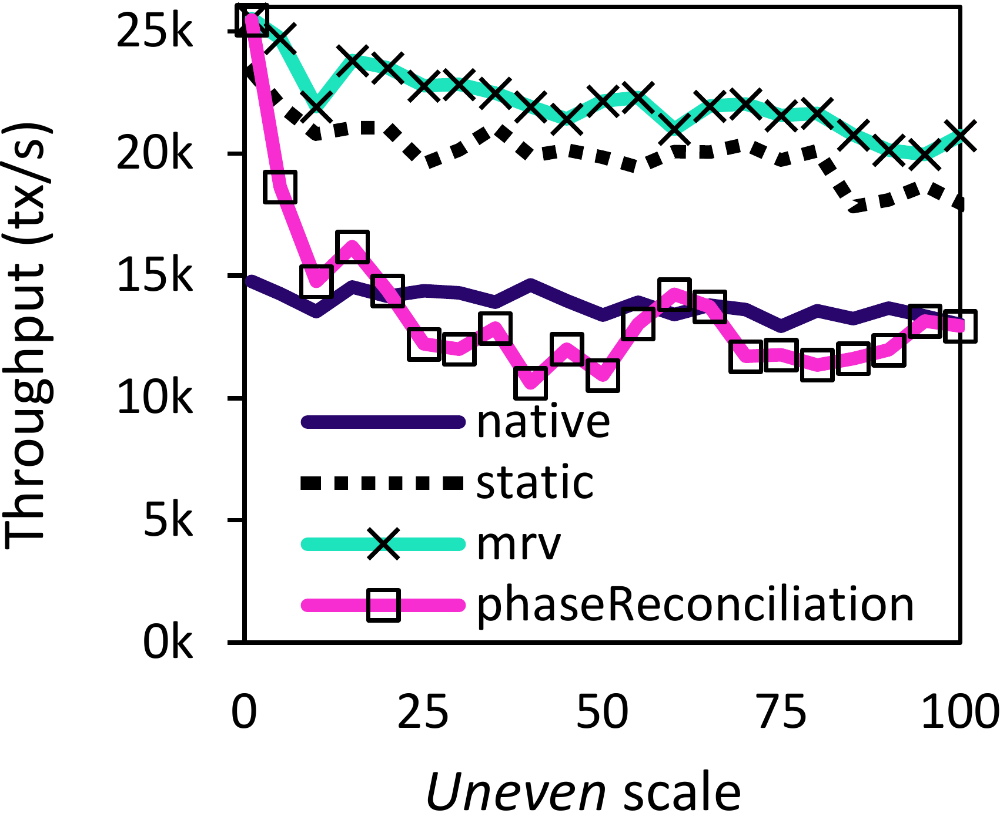
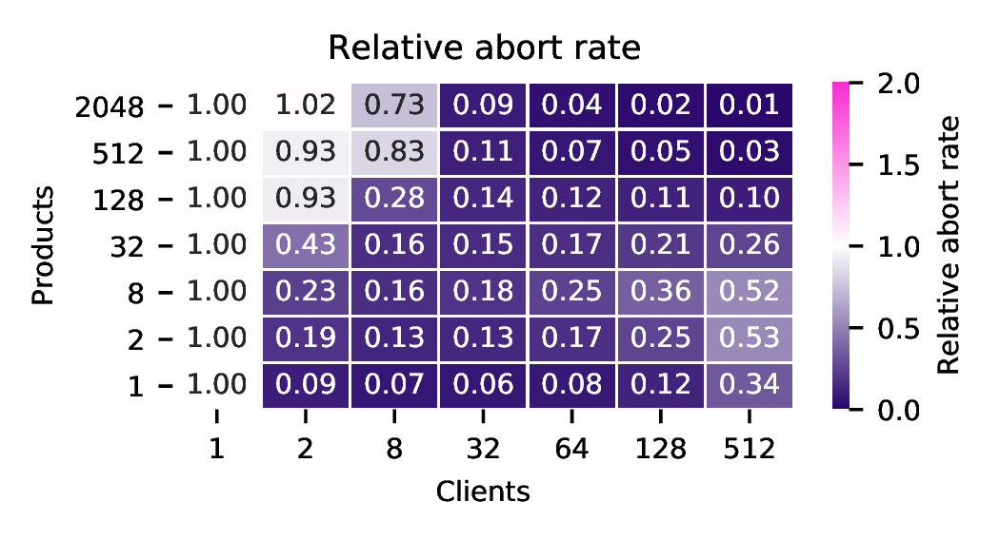
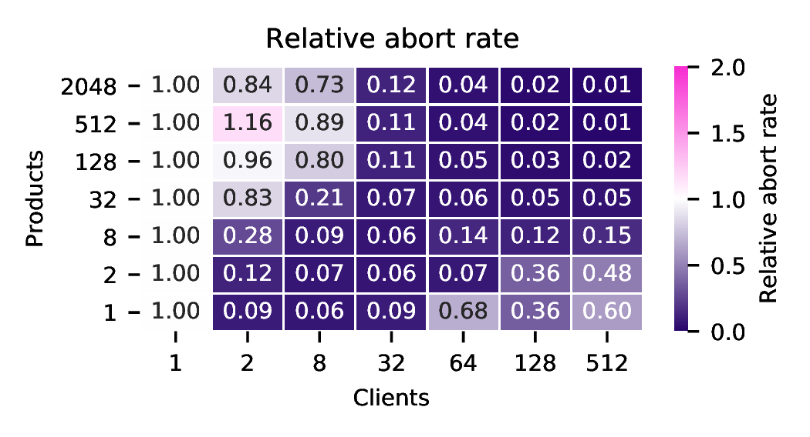

# Results

## Simulations

- The MRV collision probability based ($ar$) on the number of records ($n$) and concurrent writes ($w$) can be defined by the following mathematical formula:

    $ar(n, w) = \frac{w - (n -  n \cdot (1 - \frac{1}{n})^w)}{w}$

    The following graphs display how the $ar$ based on $n$ and $w$, and the necessary $n$ to reach some target $ar$, based on $w$. The first graph tells that as $w$ increases, $ar$ will increase for the same $n$; additionally, as $ar$ tends to 0, we will need an exponentially higher $n$. This last property is also evidently in the second chart, where decreasing the $ar$ from 5% to 1% requires exponentially more records than changing it from 10% to 5%; in this last graph it is also visible that to keep the same $ar$, $n$ grows linearly with $w$. 

    |$ar$ per $n$ and $w$|$n$ necessary to reach $ar$ based on $w$|
    |-|-|
    |||

## Workers

#### Adjust algorithms
- Comparison between different adjust algorithms (binary, linear, and quadratic) in the number of records created and the abort rate generated. Uses the microbenchmark with a single product and 8 clients; 2 extra clients are added at 60s. The target abort rate is set to 5%. Linear is considered the optimal adjust algorithm, as it converges faster and is the most stable:

    |Number of records|Abort rate|
    |-|-|
    |||

- Evolution of the total number of records and the overall abort rate with variable load increases (with 2x, 3x, and 4x increases in the number of clients between 60 and 120 seconds), using the linear algorithm:

    |Number of records|Abort rate|
    |-|-|
    |||

#### Balance algorithms
- Comparison between different balance algorithms (all, random, minmax) in the balance time, percentage of zero-value records, throughput, and abort rate. Uses the microbenchmark with 64 clients and 64 products (with no initial stock):

    |Balance time|Percentage of zero-value records|
    |-|-|
    |||

    |Throughput|Abort rate|
    |-|-|
    |||

- Comparison of the effect of different number of records balanced in each iteration (K*2) in the minmax algorithm, based on the number of records per product; the cells represent the relative difference to the baseline (K=1) in terms of balance time and percentage of zeros (lower is better):

#### Window size
- Comparison between different windows considered when adjusting and balancing records, in terms of the abort rate and the time to iterate. The adjust worker runs every second (so a window of 100% adjusts the records updated in the last second) while the balance worker runs every 100ms (so a window of 100% balances the records updated in the last 100ms):
 
    |Adjust worker|Balance worker|
    |-|-|
    |||

## Overhead

- Write and read response time overhead comparatively to the native using 1 client, 1 product, and a varying number of records per product, with PostgreSQL and MongoDB (microbenchmark):

    |Postgres write|Mongo write|Postgres read|Mongo read|
    |--|--|--|--|
    ||     ||    

- Storage overhead based on the number of clients, using three different workloads: microbenchmark with only one product, microbenchmark with 100k products and a few hotspots, and TPC-C with one warehouse:

## Performance

#### vs Escrow locking

- Comparison with escrow locking using DBx1000:

    |Throughput|Abort rate|
    |-|-|
    ||

- Comparison with escrow locking using DBx1000, but with a small artificial delay of 1μs on commit, abort, and escrow latch (to simulate a distributed system):

    |Throughput|Abort rate|
    |-|-|
    ||

#### vs Phase Reconciliation

- Testing with a variable percentage of reads/writes (microbenchmark with PostgreSQL Repeatable Read, 32 clients, 32 products):

    |Write throughput|Read throughput|
    |-|-|
    ||

- Testing with variable *uneven* scales, e.g., uneven=1 means one 1-unit add for every 1-unit sub, uneven=5 means one 5-unit add for every 5 1-unit subs, and so on (microbenchmark with PostgreSQL Repeatable Read, 32 clients, 32 products):

    |Throughput|Abort rate|
    |-|-|
    ||

#### Varying workloads

Ratio between MRV and native in terms of throughput, abort rate, and response time, for the microbenchmark, TPC-C, and STAMP Vacation, with PostgreSQL:

- **Microbenchmark**

    - Repeatable Read (one add/sub per transaction; add and sub have the same probability):
        |Throughput|Abort rate|
        |-|-|
        ||
    
    - Read Committed (one add/sub per transaction; add and sub have the same probability):
        |Throughput|Response time|
        |-|-|
        ||
    
    - Repeatable Read (three adds/subs per transaction; add and sub have the same probability):
        |Throughput|Abort rate|
        |-|-|
        ||

    - Repeatable Read (one add/sub per transaction; one add for every 99 subs):
        |Throughput|Abort rate|
        |-|-|
        ||

- **TPC-C** - (w_ytd and d_ytd modelled as MRVs)

    - Repeatable Read:
        |Throughput|Abort rate|
        |-|-|
        |||

    - Read Committed
        |Throughput|Response time|
        |-|-|
        |||

- **STAMP Vacation** - (num_free and num_total of tables Car_reservation, Flight_reservation, and Room_reservation modeled as MRVs):

    - Optimized version (manual updates instead of using rules; "WHERE numfree > x" replaced with the *gt* operation):
        |Throughput|Abort rate|
        |-|-|
        |||

    - Optimized version static MRVs (without the adjust of balance worker; fixed at 256 records):
        |Throughput|Abort rate|
        |-|-|
        |||

    - Non optimized version:
        |Throughput|Abort rate|
        |-|-|
        |||

#### Varying databases

Ratio between MRV and native in terms of throughput and abort rate, with PostgreSQL (centralized), MongoDB (3-node replica-set cluster), and MySQL Group Replication (3-node multi-writer), in the microbenchmark:

- **PostgreSQL**
    |Throughput|Abort rate|
    |-|-|
    |||

- **MongoDB**
    |Throughput|Abort rate|
    |-|-|
    |||

- **MySQL Group Replication**
    |Throughput|Abort rate|
    |-|-|
    |||

- **System X** (Codename for a popular cloud-native, closed-source NewSQL system)
    |Throughput|Abort rate|
    |-|-|
    |||

#### Varying concurrency control techniques

Throughput comparison between non-MRV (native and escrow locking; left) and MRV (right) with various concurrency control techniques, using DBx1000:

